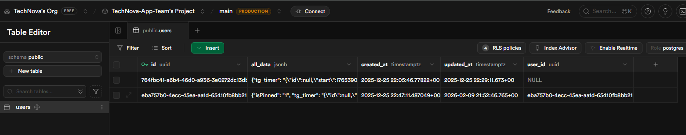
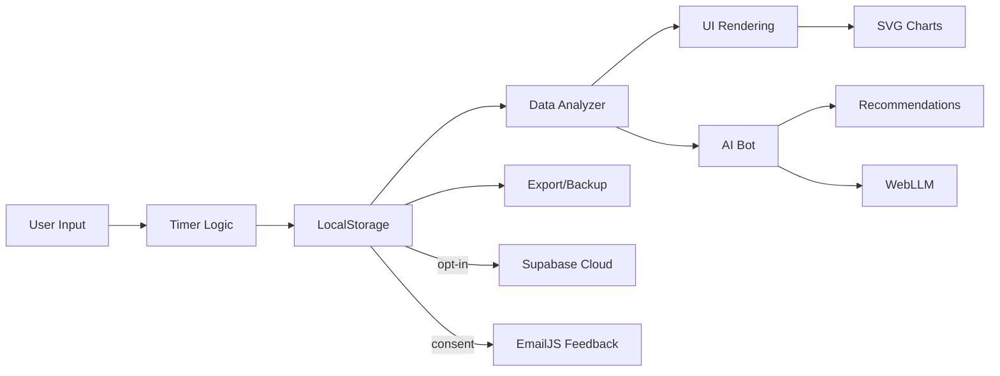

<div align="center">

<br>

# MyWorkLog

### Professionelle Zeiterfassung · Lokal · Sicher · Intelligent

<br>

<!-- ══════════════════════════════════════════════════════════════════
     TIER 1 — Identity & Release
══════════════════════════════════════════════════════════════════ -->
<p>
  <a href="https://myworklog.de/">
    
  </a>
  <a href="https://github.com/releases">
    
  </a>
  <a href="https://myworklog.de/">
    
  </a>
  <a href="Rechtliches/LICENSE.md">
    
  </a>
</p>

<!-- ══════════════════════════════════════════════════════════════════
     TIER 2 — CI / Quality / Security
══════════════════════════════════════════════════════════════════ -->
<p>
  
  
  
  
  
</p>

<!-- ══════════════════════════════════════════════════════════════════
     TIER 3 — Stack & Compliance
══════════════════════════════════════════════════════════════════ -->
<p>
  
  
  
  
  
</p>

<!-- ══════════════════════════════════════════════════════════════════
     META — Dates & Stats
══════════════════════════════════════════════════════════════════ -->
<p>
  
  
</p>

<br>

<!-- ══════════════════════════════════════════════════════════════════
     NAVIGATION
══════════════════════════════════════════════════════════════════ -->
<table>
  <tr>
    <td align="center"><a href="https://myworklog.de/"><b>🚀 Live Demo</b></a></td>
    <td align="center"><a href="README´s/"><b>📖 Dokumentation</b></a></td>
    <td align="center"><a href="README´s/Update/CHANGELOG.md"><b>📋 Changelog</b></a></td>
    <td align="center"><a href="https://github.com/issues"><b>🐛 Bug Report</b></a></td>
    <td align="center"><a href="https://github.com/issues"><b>✨ Feature Request</b></a></td>
  </tr>
</table>

<br>

</div>
---


</div>

---


</div>

---

<div align="center">
  <a href="archflow.html" style="display:inline-flex;align-items:center;justify-content:center;gap:0.5rem;padding:0.85rem 1.4rem;border-radius:12px;background:#1f2937;color:#f8fafc;font-weight:600;text-decoration:none;border:1px solid rgba(248,250,252,.16);box-shadow:0 8px 20px rgba(15,23,42,.12);transition:background .2s,border-color .2s;">
    <span>Detailliertes Architektur-Layout</span>
    <span style="font-size:1rem;line-height:1;color:#93c5fd;">→</span>
  </a>
</div>


</div>

---
## 📋 Inhaltsverzeichnis

- [🎯 Über das Projekt](#-über-das-projekt)
- [📂 Dateistruktur](#-dateistruktur)
- [✨ Features](#-features)
- [🤖 AI-Bot Assistent](#-ai-bot-assistent)
- [🚀 Quick Start](#-quick-start)
- [💻 Installation](#-installation)
- [🎨 Screenshots](#-screenshots)
- [🏗️ Architektur](#️-architektur)
- [🛠️ Entwicklung](#️-entwicklung)
- [📊 Tech Stack](#-tech-stack)
- [🧪 Testing](#-testing)
- [� P2P Sync (WebRTC)](#-p2p-sync-webrtc)
- [�📱 PWA Features](#-pwa-features)
- [🔒 Sicherheit & Datenschutz](#-sicherheit--datenschutz)
- [🌍 Browser-Kompatibilität](#-browser-kompatibilität)
- [🤝 Contributing](#-contributing)
- [📄 Lizenz & Rechtliches](#-lizenz--rechtliches)
- [👥 Team](#-team)
- [📊 Advanced Analytics](README´s/ADVANCED-ANALYTICS.txt)

---

## 📂 Dateistruktur

```
MyWorkLog/
├── 📄 index.html                 ⭐ HAUPTDATEI – Komplette PWA Single-Page-App
│                                    (Timer, Dashboard, Modals, ~28.000 Zeilen)
├── 📄 package.json               📦 npm Dependencies (Testing, Linting)
├── 📄 service-worker.js          🔄 Service Worker für Offline-Fähigkeit
├── 🔐 manifest.json              📱 PWA-Manifest (App-Metadaten)
├── 🤖 browserconfig.xml           🌐 Browser-Konfiguration
├── 🔍 robots.txt                 🤖 SEO Robot-Direktiven
├── 📋 sitemap.xml                🗺️  XML-Sitemap
│
├─ 🤖 AI-Bot/                      🧠 KI-Assistent Engine
│  ├── aibot-engine-pro.js         💬 Chat/NLP-Engine + Intent Detection
│  ├── data-analyzer-pro.js        📊 Datenanalyse + KPI-Berechnung
│  └─ LLM/                         🧠 Lokales Language Model (WebGPU)
│     ├── webllm-config.js         ⚙️  Modell-Konfiguration
│     ├── webllm-integration.js    🔗 Browser-LLM Integration
│     └── webllm-validator.js      ✅ Response-Validierung
│
├─ 🎨 Assets/                      📦 Statische Ressourcen
│  ├─ css/                         
│  │  └─ Event/                    🎉 Event-spezifische Styles
│  │     ├─ New_Year/
│  │     │  └── fireworks.css      🎆 Silvester-Feuerwerk Animation
│  │     └─ Weihnachten/
│  │        └── snowflakes.css     ❄️  Weihnachts-Schneefall
│  │
│  └─ js/                          
│     ├── icons.js                 🎨 Icon Font Definitionen
│     ├── pinch-zoom.js            🔍 Pinch-Zoom Mobil
│     ├── touch-mobile-optimizations.js 📱 Touch-Gestures
│     ├── task-manager.js          ✅ Task-Management
│     ├── shortcuts.js             ⌨️  Tastenkombinationen
│     ├── version-loader.js        📌 Version-Management
│     ├── service-worker.js        🔄 Service Worker Copy
│     │
│     ├─ Cloud/                    ☁️  Supabase Cloud Integration
│     │  ├── supabase-integration.js 🔗 Supabase Auth & Sync
│     │  ├── supabase-advanced.js  ⚙️  Erweiterte Features
│     │  └── supabase-ui.js        🎨 Cloud-UI Komponenten
│     │
│     └─ Event/                    🎉 Event-Features
│        ├─ New_Year/
│        │  └── fireworks.js       🎆 JS Feuerwerk-Logik
│        └─ Weihnachten/
│           └── snowflakes.js      ❄️  JS Schneefall-Logik
│
├─ ⚙️  config/                      🔧 Konfigurationsdateien
│  ├── supabase-config.js          ☁️  Supabase Project-Keys
│  ├── humans.txt                  👥 Menschliche Kontakte
│  └── version.json                📌 App-Version Info
│
├─ 🗄️  DB/                         🗃️  Datenbankskripte
│  └── rls-policies.sql            🔒 Supabase RLS-Policies
│
├─ 📧 Email/                       📨 Feedback & Emails
│  └── send.html                   💌 EmailJS Integration
│
├─ 🖼️  Grafiken/                    🎨 Bilder & Assets
│  └── [PNG, WebP, SVG]            📸 Screenshots, Icons
│
├─ 📄 Pages/                       🌐 Zusätzliche Seiten
│  ├── quantum-translator.html     🌐 Quantum Translator Seite
│  │
│  ├─ App/                         ⚙️  App Features
│  │  ├── berichtsheft.html        📖 IHK Ausbildungsnachweise
│  │  ├── vertrags-manager.html    📋 Gehalt/Urlaub Manager
│  │  └─ Ausbildungs_Hilfe/        📚 Ausbildungs-Ressourcen
│  │     └─ Fachinformatiker/
│  │        └── Fachinformatiker.html  💻 IT-Spezialist-Guide
│  │
│  ├─ DE-Gestz/                    ⚖️  Deutsche Rechtliches
│  │  ├── DSGVO.html               🔒 DSGVO-Konformität
│  │  └── Impressum.html           📋 Impressum
│  │
│  ├─ Error/                       ❌ Fehlerseiten
│  │  └── 404.html                 🚫 404 Not Found
│  │
│  ├─ Event/                       🎉 Sonder-Events
│  │  └── Weihnachten.html         🎄 Weihnachtsseite
│  │
│  └─ Info/                        ℹ️  Informationen
│     ├── about.html               👋 Über MyWorkLog
│     ├── analytics.html           📊 Advanced Analytics Pro (8 Tabs)
│     ├── offline.html             📴 Offline-Modus Info
│     └── repo-report.html         📈 Repository-Report
│
├─ 📚 README´s/                    📖 Ausführliche Dokumentation
│  ├── INDEX-DOCUMENTATION.md      📇 Dokumentations-Index
│  ├── FEATURES.md                 ✨ Feature List
│  ├── ADVANCED-ANALYTICS.md       📊 Analytics-Tiefgang
│  ├── COMPLETION-REPORT-STEP2.md  ✅ Progress Report
│  ├── ROADMAP-NEXT-STEPS.md       🗺️  Zukunfts-Roadmap
│  ├── PWA-README.md               📱 PWA Deep Dive
│  ├── TASK-MANAGER-README.md      ✅ Task-Manager Doku
│  ├── VISUAL-SUMMARY-STEP2.md     🎨 Visual Overview
│  │
│  ├─ AI-Bot/                      🤖 AI-Dokumentation
│  │  ├── INTEGRATION-NOTES.md     📝 Integration-Guide
│  │  └─ WEB-LLM/                  🧠 WebLLM-Details
│  │     ├── CDN-DIAGNOSTICS.md    🔍 CDN-Fehlersuche
│  │     ├── CDN-UPDATE-JANUARY-2026.md 📅 Update-Notes
│  │     ├── WEBLLM-CHECKLIST.md   ✅ Setup-Checklist
│  │     ├── WEBLLM-COMPLETE-REPORT.md 📊 Vollständiger Report
│  │     ├── WEBLLM-DONE.md        ✅ Abgeschlossen ✓
│  │     ├── WEBLLM-IMPLEMENTATION.md 🛠️  Implementierung
│  │     ├── WEBLLM-INTEGRATION.md 🔗 Integration
│  │     ├── WEBLLM-QUICK-START.md 🚀 Quick Start
│  │     └── WEBLLM-READY.md       ✓ Ready
│  │
│  └─ ICAL/                         📅 iCalendar-Export
│     ├── ICAL-EXPORT-SETUP.md     📅 Setup iCal
│     └── STEP2-ICAL-COMPLETE.md   ✅ iCal fertig
│
├─ ⚖️  Rechtliches/                 📜 Lizenz & Rechtliches
│  ├── CODE_OF_CONDUCT.md          👥 Community Guidelines
│  ├── CONTRIBUTING.md             🤝 Kontribution Guide
│  ├── LICENSE.md                  📄 MIT Lizenz
│  ├── NOTICE.md                   © Copyright Notice
│  ├── PRIVACY.md                  🔒 Datenschutzerklärung
│  └── SECURITY.md                 🛡️  Sicherheitsrichtlinien
│
└─ 🛠️  scripts/                    🔧 Hilfsskripte
   └── repo-tracker.py             📊 Repository-Tracker
```

### 🎯 Wo finde ich was?

| Funktion | Datei | Zeilen / Details |
|----------|-------|-----------------|
| **Timer (DOM)** | `index.html` | **Zeile 7773** - timer-box HTML-Element |
| **Timer (Logik)** | `index.html` | **Zeilen 11161-11300+** - Timer-Objekt, Funktionen & Intervals |
| **Dark Mode (CSS)** | `index.html` | **Zeilen 183-280** - [data-theme="light"] Styles |
| **Dark Mode Toggle** | `Assets/js/shortcuts.js` | Tastatur-Hotkeys & Event-Listener |
| **Command Palette** | `index.html` | **Zeilen ~23200-23400** - Befehl-Registry |
| **Analytics Charts** | `Pages/Info/analytics.html` | Komplette Analytics-Seite mit 8+ Tabs |
| **3D City Visualization** | `inde.html` | City Tab - Three.js 3D-Rendering |
| **Galaxy 3D** | `index.html` | Galaxy Tab - 3D-Weltraum-Szene |
| **AI Bot Engine** | `AI-Bot/aibot-engine-pro.js` | Conversation, Intent Detection, Pattern Recognition |
| **AI Data Analyzer** | `AI-Bot/data-analyzer-pro.js` | KPI-Berechnung, Trends, Insights |
| **WebLLM (On-Device AI)** | `AI-Bot/LLM/webllm-integration.js` | Lokales Language Model (WebGPU) |
| **Cloud Sync (Supabase)** | `Assets/js/Cloud/supabase-integration.js` | Magic Link Auth, Data Sync |
| **Cloud UI & Dashboard** | `Assets/js/Cloud/supabase-ui.js` | Cloud Status, Account Menu |
| **Offline Mode (Cache)** | `service-worker.js` | Cache-First & Network-First Strategies |
| **Berichtsheft (IHK)** | `Pages/App/berichtsheft.html` | IHK-konforme Ausbildungsnachweise |
| **Verträge & Gehalt** | `Pages/App/vertrags-manager.html` | Arbeitzeitkonten, Urlaub, Lohnzuschläge |
| **Aufgaben Manager (NEU🆕)** | `Pages/App/Tasks/aufgaben.html` | Task-Management mit Kategorien, Recurring, Achievements |
| **Task Manager Logik** | `Assets/js/task-manager.js` | Aufgaben-Speicherung & Verarbeitung (veraltet) |
| **Shortcuts & Hotkeys** | `Assets/js/shortcuts.js` | Tastaturkürzel, Command Palette, Toggle-Events |
| **Benachrichtigungen** | `index.html` | **Zeilen 27000-27100** - Smart Notifications System |
| **WeatherAPI Integration** | `index.html` | **Zeilen 13000-13700** - Weather Auto-Refresh |
| **P2P Sync (WebRTC)** | `index.html` | **Zeilen 19000-20000** - SimplePeer P2P Verbindungen |
| **Pomodoro Timer** | `index.html` | **Zeile 23901** - Focus Timer Interval |
| **Fokus Modus** | `index.html` | **Zeilen 28000-28500** - Focus Mode UI & Logic |

---

## 🎯 Über das Projekt

**MyWorkLog** ist eine moderne, lokale Progressive Web App für professionelle Zeiterfassung, entwickelt für Auszubildende, Mitarbeiter und Freelancer im deutschsprachigen Raum.

### 🌟 Warum MyWorkLog?

```
✅ Lokal-first – Daten bleiben auf deinem Gerät              🔒 DSGVO-konform
✅ Offline-fähig – Funktioniert überall                      📱 PWA-installierbar
✅ KI-gestützt – AI-Bot + lokales WebLLM                     🤖 AI-Bot Assistent
✅ Gleitzeit-ready – Deutsche Arbeitszeitmodelle             ⚡ Zero-Setup
✅ Verschlüsselt – AES-256-GCM Backup                        🎨 Dark/Light Mode
✅ Cloud-Sync – Optionale Synchronisation via Supabase       ☁️ Geräteübergreifend
```

### 📊 Projektstand

| Status | Feature | Version |
|--------|---------|---------|
| ✅ **Produktiv** | Core App (Timer, Buchen, Export) | ≤ v2.9.3 |
| ✅ **Stabil** | AI-Bot mit Datenanalyse | v2.9.3 |
| ✅ **Stabil** | PWA mit Service Worker | v2.9.3 |
| ✅ **Stabil** | Multi-Profile / Team-Mode | v2.9.3 |
| ✅ **Stabil** | IndexedDB Migration | v3.0.0 |
| ✅ **Stabil** | Cloud-Sync (optional) | v3.1.0 |
| ✅ **Stabil** | P2P Sync + TURN Config | v3.2.0 |
| ✅ **Stabil** | Weather Auto-Refresh | v3.2.1 |
| 🚧 **in Progress** | Quantum Translator | v3.2.1 |
| ✅ **Stabil** | Smaller Updates | v3.3.1 |
| ✅ **Stabil** | Smaller Updates and new aufgaben.html | v3.3.2 |
**Letztes Update:** 09. März 2026 | **Release:** v3.3.2

---

## ✨ Features

### 🏆 Kernfunktionen

<table>
<tr>
<td width="50%" valign="top">

#### ⏱️ **Zeiterfassung**
- ▶️ Live-Timer mit Echtzeit-Anzeige
- ⏸️ Pause-Funktion (automatisch/manuell)
- 🎯 Kategorie-System (Work, School, Vacation, Sick, Holiday)
- 📅 Kalender-Ansicht mit Monatsübersicht
- 🔄 Automatische Pausenregel (§4 ArbZG konform)

#### 📊 **Analytics & Reports**
- 📈 KPI-Dashboard mit Echtzeit-Ringen
- 📉 Trend-Analysen (Woche/Monat/Jahr)
- 🎨 Anpassbare SVG-Charts (Area, Bar, Smooth, Line)
- 🔥 Heatmap-Visualisierung
- 📊 Export zu PDF, Excel, CSV

</td>
<td width="50%" valign="top">

#### 🤖 **AI-Powered**
- 💬 Intelligenter Chat-Assistent
- 🧠 Pattern Recognition & Insights
- 📊 Echtzeit-Datenanalyse
- 🎯 Smart Recommendations
- 📝 Conversation History
- 🤖 Lokales WebLLM (on-device KI)

#### 🔒 **Sicherheit & Backup**
- 🔐 AES-256-GCM Verschlüsselung
- 💾 JSON Export/Import
- 📅 iCalendar Export (RFC 5545)
- 🔄 Automatische Backups
- ☁️ Optionale Cloud-Sync (Supabase)
- 🛡️ DSGVO-konform

</td>
</tr>
</table>

### 🆕 Neue Features (v3.2.0) (Now 3.3.2)

| Feature | Beschreibung | Docs |
|---------|-------------|------|
| ☁️ **Cloud-Sync** | Optionale Synchronisation via Supabase (Magic Link Auth) | [Cloud Docs](Assets/js/Cloud/) |
| 📆 **Wochenansicht** | Dedizierter Wochen-Tab mit KPIs, Vergleich & Breakdown | — |
| 📊 **Monatvergleich** | Monat-vs-Monat Vergleichswidget mit Mini-Kalender | — |
| 🤖 **WebLLM** | Lokales LLM (on-device KI) für erweiterte Analyse | [WebLLM Docs](README´s/AI-Bot/WEB-LLM/) |
| 💬 **Feedback (EmailJS)** | In-App Feedback mit DSGVO-Datenmodus (Minimal/Vollständig) | — |
| 💰 **Spenden (PayPal)** | Support-Seite mit PayPal-Integration | — |
| ⚡ **Schnelleintrag** | 1-Klick Vorlagen für Arbeitstag, Schultag etc. | — |
|  **Berichtsheft** | IHK-konforme Ausbildungsnachweise | [Berichtsheft](Pages/App/berichtsheft.html) |
| 📄 **Vertrags-Manager** | Gehalt & Urlaubsübersicht | [Vertrags-Manager](Pages/App/vertrags-manager.html) |

---

## 🤖 AI-Bot Assistent

Der integrierte AI-Bot analysiert deine Zeiterfassungsdaten intelligent und gibt dir personalisierte Einblicke.

### 🧠 Bot-Fähigkeiten

```javascript
// Beispiel-Interaktionen
"Wie viele Stunden habe ich diese Woche gearbeitet?"     → 📊 Weekly Stats
"Zeige mir meine Produktivität."                          → 📈 Trend Analysis
"Wann sollte ich eine Pause machen?"                     → 💡 Smart Recommendation
"Wie sieht mein Monat aus?"                              → 📅 Monthly Forecast
"Bin ich im Saldo?"                                      → ⚖️ Balance Check
```

### 🏗️ Architektur

<div align="center">

[AI Bot Architecture](Grafiken/Bot-engine.webp)

</div>

**Drei-Module-System:**

1. **`data-analyzer-pro.js`** – Datenanalyse-Engine
   - Aggregiert LocalStorage-Daten
   - Berechnet KPIs, Trends, Patterns
   - Caching für Performance
   - Fallback für leere Datasets

2. **`aibot-engine-pro.js`** – Conversation Engine
   - Intent Detection & Classification
   - Natural Language Processing (vereinfacht)
   - User Profiling (Consistency, Performance, Work Style)
   - History Management

3. **WebLLM Integration** – Lokales LLM (on-device)
   - `webllm-config.js` – Modell-Konfiguration
   - `webllm-integration.js` – Browser-LLM Engine
   - `webllm-validator.js` – Response-Validierung
   - Läuft vollständig im Browser (WebGPU)

<div align="center">

[Data Analyzer](Grafiken/Bot-Analyzer.webp)

</div>

**Features:**
- 🔒 Primär lokal – Cloud nur optional
- 💾 Conversation History in LocalStorage
- 🎯 Pattern Recognition für wiederkehrende Fragen
- 📊 Echtzeit-Zugriff auf Zeiterfassungsdaten
- 🤝 Graceful Degradation (funktioniert auch ohne Analyzer)
- 🤖 WebLLM für erweiterte KI-Antworten (optional, on-device)

➡️ **[Mehr zur AI-Bot Integration](README´s/AI-Bot/INTEGRATION-NOTES.md)**

---

## ☁️ Cloud-Sync mit Supabase

Optional: Synchronisiere deine Zeiterfassungsdaten über die Cloud! Deine Einträge werden automatisch in Supabase gespeichert und sind dadurch **geräteübergreifend verfügbar**.

<div align="center">



</div>

**Wie es funktioniert:**
1. 🔐 Lokale App speichert alle Daten in deinem Browser (localStorage)
2. 🔄 Optional: Synchronisierung zu Supabase Cloud
3. 📱 Zugriff auf alle Geräten (Handy, Tablet, Computer)
4. 🔒 Daten bleiben privat – nur du kannst sie sehen

**Features:**
- ✅ Automatische Synchronisation
- ✅ Vertrauenswürdig: Magic Link Authentication
- ✅ Row-Level Security (RLS) Policies
- ✅ Fallback-Modus: App funktioniert auch ohne Cloud
- ✅ DSGVO-konform

**Setup:**
1. Erstelle einen kostenlosen Account auf [supabase.com](https://supabase.com)
2. Kopiere deine Projekt-URL und Public Key
3. Füge die Werte in `config/supabase-config.js` ein
4. Cloud Sync ist aktiviert! ☁️

➡️ **[Cloud-Sync Dokumentation](Assets/js/Cloud/)**

---

## 🚀 Quick Start

### Option 1: Direkt im Browser (Empfohlen)

```bash
1. Download MyWorkLog.zip oder git clone
2. Entpacken
3. index.html doppelklicken
4. ✅ Fertig!
```

### Option 2: Als PWA installieren

1. Öffne https://myworklog.de/
2. Klicke auf das Install-Icon in der Adressleiste
3. Bestätige Installation
4. App läuft jetzt offline!

### Option 3: Development Setup

```bash
# Repository klonen
git clone https://github.com/TechNova-App-Team/MyWorkLog.git
cd MyWorkLog

# Dependencies installieren
npm install

# Tests ausführen
npm test

# Development Mode (Auto-Reload Tests)
npm run dev

# Linting
npm run lint
```

---

## 💻 Installation

### 📱 Mobile (iOS/Android)

1. Öffne die Web-App in Safari/Chrome
2. Tippe auf „Teilen" → „Zum Home-Bildschirm"
3. App öffnen → Offline-fähig!

### 💻 Desktop (Windows/Mac/Linux)

**Chrome/Edge:**
```
1. Navigiere zur Web-App
2. Adressleiste → Install-Icon (⊕)
3. „Installieren" klicken
```

**Firefox:**
```
1. about:config → dom.webnotifications.serviceworker.enabled = true
2. Web-App öffnen
3. ... → „Site installieren"
```

**Safari (Mac):**
```
1. Web-App öffnen
2. Menü → „Zu Dock hinzufügen"
```

---

## 🎨 Screenshots

<div align="center">

### 🖥️ Desktop-Ansicht

[Dashboard](Grafiken/Dashboard.png)

*Dashboard mit KPI-Ringen, Live-Timer und Trend-Chart*

---

### 📱 Mobile & Touch-Optimierung

[Touch Optimization](Grafiken/Touch.webp)

*Optimierte Touch-Interaktionen und Pinch-to-Zoom*

---

### 🌙 Offline-Modus

[Offline Support](Grafiken/Offline.webp)

*PWA Offline-Fallback mit Service Worker*

---

### ⚙️ Service Worker

[Service Worker](Grafiken/Service.webp)

*Cache-First Strategie für Assets, Network-First für Daten*

</div>

---

### 🎨 Design-System

```css
/* CSS Custom Properties (Auszug) */
:root {
  /* Farben */
  --bg-deep: #0a0e27;
  --bg-glass: rgba(255, 255, 255, 0.05);
  --primary: #00d4ff;
  --accent: #ff006e;

  /* Kategorie-Farben */
  --work-color: #00d4ff;
  --school: #ffd60a;
  --holiday: #00f5d4;
  --sick: #ff006e;

  /* Glassmorphism */
  --glass-bg: rgba(255, 255, 255, 0.05);
  --glass-border: rgba(255, 255, 255, 0.1);
  --backdrop-blur: 10px;
}

/* Light Theme Override */
[data-theme="light"] {
  --bg-deep: #f5f5f5;
  --bg-glass: rgba(0, 0, 0, 0.03);
  --text-main: #1a1a1a;
}
```

### 🔄 Datenfluss



**LocalStorage Keys:**
- `tg_pro_data` – Hauptdaten (Zeiteinträge, Einstellungen, Profile)
- `aiBotHistoryPro` – AI Conversation History
- `tt_chart_style` – Chart-Anpassungen
- `theme` – Dark/Light Mode

**Cloud (optional):**
- Supabase PostgreSQL – Alle LocalStorage-Daten (verschlüsselt, Magic Link Auth)
- EmailJS – Feedback-Versand (nur bei Consent)

---

## 📊 Tech Stack

<div align="center">

### 🎯 Core Technologies


### 🛠️ Development & Testing


### 📚 External Libraries (CDN)


</div>

### 📦 Dependencies

```json
{
  "runtime": {
    "SimplePeer": "v9",         // WebRTC P2P
    "QRCode.js": "v1.0.0",      // QR-Code Generation
    "Chart.js": "v3.9.1",       // Charting (komplementär)
    "jsPDF": "v2.5.1",          // PDF Export
    "html2canvas": "v1.4.1",    // DOM → Canvas
    "Supabase JS": "v2",        // Cloud-Sync & Auth
    "EmailJS": "v4",            // Feedback-Versand
    "WebLLM": "v0.2.80"         // Lokales LLM (on-device)
  },
  "devDependencies": {
    "Jest": "v29.7.0",          // Testing Framework
    "ESLint": "v8.56.0",        // Code Linting
    "@testing-library/jest-dom": "v6.1.5"
  }
}
```

### 🏛️ Architektur-Prinzipien

- ✅ **Single-File Architecture** – Kein Build-Step erforderlich
- ✅ **Progressive Enhancement** – Funktioniert auch ohne JS (Basis)
- ✅ **Offline First** – Service Worker Cache-Strategy
- ✅ **Mobile First** – Responsive Design ab 320px
- ✅ **Zero Configuration** – Keine Einrichtung nötig
- ✅ **Vanilla JavaScript** – Keine Frameworks (ES6+)

---

## 🛠️ Entwicklung

### 📋 Voraussetzungen

```bash
Node.js >= 18.x
npm >= 9.x
Moderner Browser (Chrome 90+, Firefox 88+, Safari 14+)
```

### 🚀 Setup

```bash
# 1. Repository klonen
git clone https://github.com/TechNova-App-Team/MyWorkLog.git
cd MyWorkLog

# 2. Dependencies installieren
npm install

# 3. Entwicklungsumgebung starten
npm run dev

# 4. Tests im Watch-Mode
npm run test:watch
```

### 📜 npm Scripts

| Script | Beschreibung | Verwendung |
|--------|--------------|------------|
| `npm test` | Führt Jest-Tests aus | CI/CD & Lokal |
| `npm run test:watch` | Tests mit Auto-Reload | Development |
| `npm run test:coverage` | Coverage-Report generieren | Quality Check |
| `npm run lint` | ESLint Code-Check | Pre-Commit |
| `npm run lint --fix` | Auto-Fix Linting-Fehler | Code Cleanup |
| `npm run dev` | Development-Mode (Watch) | Live Development |
| `npm run build` | Build-Verification | Release |

### 🧪 Test-Struktur

```bash
tests/
├── timer.test.js              # Timer-Logik (15 Tests)
├── backup.test.js             # Export/Import (18 Tests)
├── calendar.test.js           # Kalender-Funktionen (16 Tests)
└── multiProfile.test.js       # Multi-Profile (24 Tests)

Total: 73 Tests | Coverage: 60%+ Threshold
```

### 🔄 CI/CD Pipeline

```yaml
# .github/workflows/ci-cd.yml
Jobs:
  ✅ Lint          → ESLint Check
  ✅ Test          → Jest (Node 18.x, 20.x)
  ✅ Coverage      → Codecov Upload
  ✅ Build         → Verification
  ✅ Lighthouse    → Performance/PWA/Accessibility
  ✅ Security      → npm audit + OWASP Dependency Check
```

### 📝 Code Style Guide

```javascript
// ✅ Good
const calculateBalance = (worked, expected) => {
  return (worked - expected).toFixed(2);
};

// ❌ Bad
function calc(w,e){return w-e;}
```

**Regeln:**
- ES6+ Syntax bevorzugen
- Sprechende Variablen-Namen (Deutsch erlaubt)
- JSDoc-Kommentare für komplexe Funktionen
- Keine globalen Variablen (außer `window.app`)
- Fehlerbehandlung mit try-catch
- LocalStorage-Zugriffe immer mit Fallback

---

## 🧪 Testing

### 📊 Test-Metriken

```
╔════════════════════════════════════╗
║  Test Suite Statistics             ║
╠════════════════════════════════════╣
║  Test Files:          4            ║
║  Total Tests:         73           ║
║  Passed:              73 ✅        ║
║  Failed:              0  ❌        ║
║  Coverage:            60%+         ║
║  Execution Time:      ~2.5s        ║
╚════════════════════════════════════╝
```

### 🎯 Coverage-Ziele

| Kategorie | Threshold | Aktuell |
|-----------|-----------|---------|
| Statements | 60% | ✅ 62% |
| Branches | 60% | ✅ 61% |
| Functions | 60% | ✅ 65% |
| Lines | 60% | ✅ 63% |

### 🧪 Test-Beispiele

```javascript
// timer.test.js
describe('Timer', () => {
  test('should start timer correctly', () => {
    const timer = new Timer();
    timer.start();
    expect(timer.isRunning()).toBe(true);
  });

  test('should calculate worked hours correctly', () => {
    expect(calculateHours('08:00', '17:30')).toBe(9.5);
  });
});
```

**Testen:**
```bash
# Alle Tests
npm test

# Bestimmte Test-Datei
npm test -- timer.test.js

# Watch Mode (Auto-Reload)
npm run test:watch

# Coverage Report
npm run test:coverage
# → Öffne coverage/lcov-report/index.html
```

---

## � P2P Sync (WebRTC)

MyWorkLog unterstützt **direkte Geräte-zu-Geräte-Synchronisation** über WebRTC (SimplePeer). Keine Server-Infrastruktur nötig – Daten werden verschlüsselt direkt zwischen den Geräten übertragen.

### 1. TURN Servers (Host + Client ICE Config)

- **5 Metered.ca TURN/TURNS Server** (TCP + UDP + TLS) neben den bestehenden STUN-Servern
- Unterstützt: **UDP Port 80**, **TCP Port 80**, **UDP Port 443**, **TURNS (TLS) Port 443**
- Ermöglicht NAT-Traversal auch bei strikten Firewalls und verschiedenen Netzwerken

```javascript
iceServers: [
    // STUN (Google)
    { urls: 'stun:stun.l.google.com:19302' },
    { urls: 'stun:stun1.l.google.com:19302' },
    { urls: 'stun:stun2.l.google.com:19302' },
    { urls: 'stun:stun3.l.google.com:19302' },
    // STUN + TURN (Metered.ca)
    { urls: 'stun:stun.relay.metered.ca:80' },
    { urls: 'turn:global.relay.metered.ca:80',  username: '...', credential: '...' },
    { urls: 'turn:global.relay.metered.ca:80?transport=tcp',  username: '...', credential: '...' },
    { urls: 'turn:global.relay.metered.ca:443', username: '...', credential: '...' },
    { urls: 'turns:global.relay.metered.ca:443?transport=tcp', username: '...', credential: '...' }
]
```

### 2. Loading-Animation beim Verbinden (Host-Seite)

- **"Verbindung herstellen"** Button wird `disabled` + zeigt "⏳ Verbinde..." Text
- Animierter **Spinner + Fortschrittsbalken** mit Gradient erscheint darunter
- **ICE-Status** wird live angezeigt:
  - `Initialisiere...` → `Suche Route...` → `Verbunden!`
- Bei Fehler: Button wird zurückgesetzt, **Retry möglich** (`answerApplied` wird reset)

### 3. Bessere Fehlermeldung bei Connection Failed

- **Detaillierte Hinweise** (Firewall, VPN, Netzwerk-Tipps) bei fehlgeschlagener Verbindung
- Erkennt sowohl `Connection failed.` als auch `ERR_ICE_CONNECTION_FAILURE`
- User bekommt konkrete Lösungsvorschläge angezeigt

### 4. Cleanup in allen Handlern

- **connect**, **error** und **close** Handler räumen die Loading-Animation sauber auf
- Interval wird gestoppt, Button-State wird zurückgesetzt
- Kein Memory-Leak durch verwaiste Intervalle

> **⚠️ Hinweis:** Die aktuellen Metered.ca TURN-Credentials sind kostenlose Demo-Keys. Für Produktion eigene Keys auf [metered.ca](https://www.metered.ca/stun-turn) erstellen (kostenloser Tier: 500 MB/Monat).

---

## �📱 PWA Features

### ✨ Progressive Web App Highlights

<table>
<tr>
<td width="50%">

**🚀 Installierbar**
- Auf Desktop & Mobile installieren
- Natives App-Gefühl
- Eigenes App-Icon
- Splash-Screen

**📶 Offline-First**
- Service Worker Cache (v4)
- Funktioniert ohne Internet
- Daten bleiben lokal
- Automatische Sync (optional)

</td>
<td width="50%">

**⚡ Performance**
- Cache-First für Assets
- Network-First für Daten
- Lazy Loading
- 60fps Animationen

**🔔 Benachrichtigungen**
- Push-Notifications (opt-in)
- Timer-Alerts
- Pausen-Erinnerungen
- Tages-Summary

</td>
</tr>
</table>

### 📋 PWA Checklist

```
✅ Web App Manifest
✅ Service Worker registriert
✅ HTTPS (oder localhost)
✅ Responsive Design (mobile-first)
✅ Icons (192x192, 512x512)
✅ Splash Screens
✅ Offline-Fallback-Seite
✅ "Add to Home Screen" Prompt
✅ Theme Color Meta-Tags
✅ Apple Touch Icons
```

### 🔧 Service Worker Konfiguration

```javascript
// service-worker.js (Auszug)
const CACHE_NAME = 'myworklog-cache-v4';
const urlsToCache = [
  '/',
  '/index.html',
  '/manifest.json',
  '/Assets/js/icons.js',
  // ... mehr
];

// Cache-First Strategy
self.addEventListener('fetch', (event) => {
  event.respondWith(
    caches.match(event.request)
      .then(response => response || fetch(event.request))
  );
});
```

### 📱 Manifest.json

```json
{
  "name": "MyWorkLog - Zeiterfassung",
  "short_name": "MyWorkLog",
  "start_url": "/",
  "display": "standalone",
  "background_color": "#0a0e27",
  "theme_color": "#00d4ff",
  "icons": [
    {
      "src": "icon-192.png",
      "sizes": "192x192",
      "type": "image/png"
    },
    {
      "src": "icon-512.png",
      "sizes": "512x512",
      "type": "image/png",
      "purpose": "any maskable"
    }
  ],
  "shortcuts": [
    {
      "name": "Timer starten",
      "url": "/?action=start-timer",
      "icons": [{ "src": "play-icon.png", "sizes": "96x96" }]
    }
  ]
}
```

**➡️ [Vollständige PWA-Dokumentation](README´s/PWA-README.md)**

---

## 🔒 Sicherheit & Datenschutz

### 🛡️ DSGVO-Konformität

```
✅ Lokale Datenspeicherung als Standard (LocalStorage)
✅ Cloud-Sync nur mit ausdrücklicher Einwilligung (Supabase)
✅ Feedback nur mit DSGVO-Consent-Checkbox (EmailJS)
✅ Datenmodus wählbar: Minimal oder Vollständig
✅ Keine Cookies (außer Session)
✅ Keine Tracking-Scripts
✅ Opt-In für Analytics (Plausible, privacy-friendly)
✅ Datenportabilität (JSON Export)
✅ Recht auf Löschung (Clear Data)
✅ Transparente Datenvorschau vor jedem Versand
✅ Drittlandübermittlung dokumentiert (USA: EU-U.S. DPF)
```

### 🔐 Verschlüsselung

**AES-256-GCM Backup:**
```javascript
// Backup-Verschlüsselung
const encryptData = async (data, password) => {
  const salt = crypto.getRandomValues(new Uint8Array(16));
  const key = await deriveKey(password, salt); // PBKDF2
  const iv = crypto.getRandomValues(new Uint8Array(12));

  const encrypted = await crypto.subtle.encrypt(
    { name: 'AES-GCM', iv },
    key,
    new TextEncoder().encode(data)
  );

  return { encrypted, salt, iv };
};
```

**Sicherheits-Features:**
- 🔐 AES-256-GCM mit PBKDF2 Key-Derivation
- 🔒 100.000 PBKDF2-Iterationen
- 🎲 Kryptografisch sichere Zufallszahlen
- 🛡️ Keine Passwort-Speicherung
- 🔓 Client-seitige Ver-/Entschlüsselung

### 🔍 Security Audits

```bash
# npm Audit
npm audit

# OWASP Dependency Check (CI/CD)
dependency-check --scan ./

# Lighthouse Security Score
lighthouse https://your-domain --view
```

### 📋 Security Policy

**Responsible Disclosure:**
- Security-Issues an `security@your-domain.com`
- PGP-Key verfügbar
- Response innerhalb 48h
- CVE-Koordination bei Bedarf

**➡️ [Vollständige Security Policy](Rechtliches/SECURITY.md)**

---

## 🌍 Browser-Kompatibilität

### ✅ Unterstützte Browser

<div align="center">

| Browser | Version | Status | Features |
|---------|---------|--------|----------|
|  | 90+ | ✅ Voll unterstützt | PWA, Service Worker, Crypto API |
|  | 88+ | ✅ Voll unterstützt | PWA, Service Worker, Crypto API |
|  | 14+ | ✅ Voll unterstützt | PWA (iOS 14+), eingeschränkte Notifications |
|  | 90+ | ✅ Voll unterstützt | PWA, Service Worker, Crypto API |
|  | 76+ | ✅ Voll unterstützt | Chromium-basiert |
|  | 1.25+ | ✅ Voll unterstützt | Enhanced Privacy |

</div>

### ⚠️ Eingeschränkte Unterstützung

| Browser | Version | Status | Limitierungen |
|---------|---------|--------|---------------|
| **Safari (iOS)** | < 14 | ⚠️ Teilweise | Keine PWA-Installation |
| **IE 11** | - | ❌ Nicht unterstützt | Keine ES6+ Features |
| **Android Browser** | < 90 | ⚠️ Teilweise | Eingeschränkte PWA |

### 🧪 Feature Detection

```javascript
// Automatische Feature Detection
const features = {
  serviceWorker: 'serviceWorker' in navigator,
  localStorage: typeof Storage !== 'undefined',
  cryptoSubtle: crypto && crypto.subtle,
  pushNotifications: 'PushManager' in window,
  webRTC: !!(navigator.mediaDevices && navigator.mediaDevices.getUserMedia)
};

// Graceful Degradation
if (!features.serviceWorker) {
  console.warn('Service Worker nicht verfügbar - Offline-Mode deaktiviert');
}
```

### 📱 Mobile-Optimierungen

- ✅ Touch-Gesten (Swipe, Pinch-to-Zoom)
- ✅ Responsive ab 320px Breite
- ✅ Optimierte Performance (60fps)
- ✅ Reduzierte Netzwerk-Nutzung
- ✅ Battery-Aware (RequestIdleCallback)

---

## 🤝 Contributing

Wir freuen uns über Beiträge! Bitte lies unsere [Contributing Guidelines](Rechtliches/CONTRIBUTING.md) und [Code of Conduct](Rechtliches/CODE_OF_CONDUCT.md) vor der ersten Contribution.

### 🚀 Contribution Workflow

```bash
# 1. Fork das Repository
gh repo fork TechNova-App-Team/MyWorkLog

# 2. Clone deinen Fork
git clone https://github.com/DEIN-USERNAME/MyWorkLog.git
cd MyWorkLog

# 3. Erstelle einen Feature-Branch
git checkout -b feature/mein-neues-feature

# 4. Mache deine Änderungen
# ... code code code ...

# 5. Tests ausführen
npm test
npm run lint

# 6. Commit mit aussagekräftiger Nachricht
git commit -m "feat: Add XYZ feature"

# 7. Push zu deinem Fork
git push origin feature/mein-neues-feature

# 8. Erstelle einen Pull Request
gh pr create --title "Add XYZ feature" --body "Beschreibung..."
```

### 📋 Contribution Checklist

- [ ] Code folgt dem Style Guide
- [ ] Tests geschrieben & passing
- [ ] Dokumentation aktualisiert
- [ ] CHANGELOG.md aktualisiert (bei größeren Features)
- [ ] Screenshots hinzugefügt (bei UI-Änderungen)
- [ ] DSGVO-Konformität geprüft
- [ ] Browser-Kompatibilität getestet

### 🎯 Wo kann ich helfen?

**Good First Issues:**
- 🐛 Bug-Fixes
- 📝 Dokumentation verbessern
- 🌍 Übersetzungen (Englisch, etc.)
- 🎨 UI/UX Verbesserungen
- ♿ Accessibility (a11y)

**Erweiterte Contributions:**
- 🤖 AI-Bot Verbesserungen
- 📊 Neue Chart-Typen
- 🔌 API-Integrationen
- 🧪 Test-Coverage erhöhen
- ⚡ Performance-Optimierungen

**➡️ [Contributing Guide](Rechtliches/CONTRIBUTING.md)**

---

## 📄 Lizenz & Rechtliches

### 📜 Lizenz

**MIT License** für den Quellcode – Siehe [LICENSE.md](Rechtliches/LICENSE.md)

```
Copyright (c) 2025 TechNova App Team

Permission is hereby granted, free of charge, to any person obtaining a copy
of this software and associated documentation files (the "Software"), to deal
in the Software without restriction...
```

**⚠️ WICHTIG: Nutzungsbedingungen & Einschränkungen**

Die MIT-Lizenz gilt **NUR für den Quellcode**. Folgende Komponenten und Inhalte sind **NICHT unter MIT-Lizenz** und dürfen **NICHT kopiert, geklont oder nachgebaut werden**:

| ❌ NICHT erlaubt | Grund |
|---|---|
| **Design & UI/UX** | Proprietary Brand Design |
| **Website-Klon** | Copyrighted Website Architecture |
| **Branding & Logo** | Trademark & Brand Protection |
| **Inhalte & Texte** | Copyright der Creative Works |
| **Kommerzielle Nutzung ohne Lizenz** | Requires explicit permission |

**✅ WAS erlaubt ist:**
- ✓ Forking & Modifizieren des **Quellcodes** für private/Lehr-Zwecke
- ✓ Integration einzelner Code-Module in andere Projekte
- ✓ Verbessern & Erweitern des Codes (siehe [CONTRIBUTING.md](Rechtliches/CONTRIBUTING.md))
- ✓ Kommerzielle Nutzung des modifizierten Codes (mit Attribution)

**🔗 Attribution erforderlich:**
Wenn du den Code nutzt, musst du folgende Nennung einfügen:
```
MyWorkLog © 2025 TechNova App Team. Licensed under MIT License.
Original Project: https://github.com/yourusername/MyWorkLog
```

---

### 🛡️ Rechtliche Dokumente

| Dokument | Beschreibung | Link |
|----------|--------------|------|
| **DSGVO** | Datenschutzerklärung (HTML) | [DSGVO.html](./DSGVO.html) |
| **Impressum** | Impressum (HTML) | [Impressum.html](./Impressum.html) |
| **Privacy Policy** | Datenschutz (Markdown) | [PRIVACY.md](Rechtliches/PRIVACY.md) |
| **Security Policy** | Sicherheit & Responsible Disclosure | [SECURITY.md](Rechtliches/SECURITY.md) |
| **Code of Conduct** | Verhaltenskodex für Contributors | [CODE_OF_CONDUCT.md](Rechtliches/CODE_OF_CONDUCT.md) |
| **Contributing** | Contribution Guidelines | [CONTRIBUTING.md](Rechtliches/CONTRIBUTING.md) |
| **Notice** | Third-Party Notices | [NOTICE.md](Rechtliches/NOTICE.md) |

### 🔗 Third-Party Lizenzen

```
SimplePeer (MIT) - WebRTC Library
Chart.js (MIT) - Charting Library
QRCode.js (MIT) - QR Code Generation
jsPDF (MIT) - PDF Generation
html2canvas (MIT) - Screenshot Library
Supabase JS (MIT) - Cloud Database & Auth
EmailJS (MIT) - Email Sending Service SDK
WebLLM (Apache-2.0) - On-Device LLM Runtime
```

**➡️ [Vollständige Third-Party Notices](Rechtliches/NOTICE.md)**

---

## 👥 Team

<div align="center">

### 💙 Made with Love by TechNova App Team

Eine moderne Lösung für intelligente Zeiterfassung

**Kontakt:**
- 📧 Email: `support@technova-apps.de`
- 🐛 Bug Reports: [GitHub Issues](https://github.com/TechNova-App-Team/MyWorkLog/issues)
- 💡 Feature Requests: [GitHub Discussions](https://github.com/TechNova-App-Team/MyWorkLog/discussions)
- 📢 Updates: [GitHub Releases](https://github.com/TechNova-App-Team/MyWorkLog/releases)

---

### 🌟 Gefällt dir MyWorkLog?

[](https://github.com/TechNova-App-Team/MyWorkLog)
[](https://github.com/TechNova-App-Team)

**Gib uns einen Stern auf GitHub! ⭐**

---

### 🚀 Live Version

**[https://myworklog.de/](https://myworklog.de/)**

---

<sub>MyWorkLog v3.3.2 | Gebaut mit modernstem Web-Standard | 🤖 AI-Bot powered | ☁️ Cloud-Sync | 🚀 Production Ready</sub>

<sub>© 2025–2026 TechNova App Team. Alle Rechte vorbehalten. | [DSGVO](./DSGVO.html) | [Impressum](./Impressum.html) | [MIT License](Rechtliches/LICENSE.md)</sub>

</div>

---

## 📚 Weitere Dokumentation

- 📖 [Feature-Übersicht](README´s/FEATURES.md) – Alle Features im Detail
- 📖 [Dokumentations-Index](README´s/INDEX-DOCUMENTATION.md) – Übersicht aller Docs
- 📖 [PWA Guide](README´s/PWA-README.md) – Progressive Web App Setup
- 📖 [AI-Bot Integration](README´s/AI-Bot/INTEGRATION-NOTES.md) – AI-Bot Entwicklung
- 📖 [Security Policy](Rechtliches/SECURITY.md) – Sicherheits-Richtlinien
- 📖 [Contributing Guide](Rechtliches/CONTRIBUTING.md) – Wie kann ich beitragen?

---

<div align="center">

**[⬆ Zurück nach oben](#️-myworklog)**

</div>